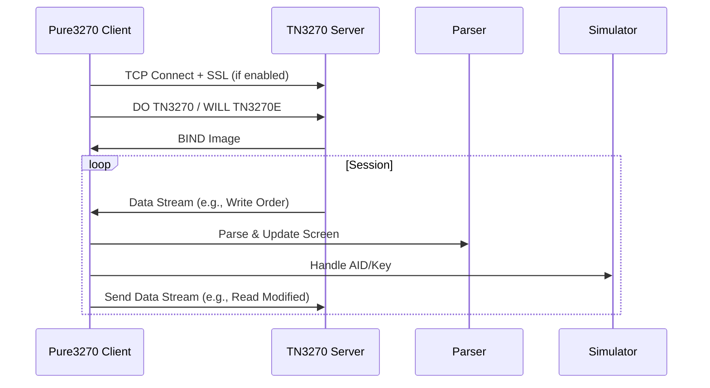

# Pure3270 Architecture Design

## Overview

The `pure3270` library is a self-contained, pure Python 3.8+ implementation designed to emulate the functionality of the `s3270` terminal emulator. It is primarily intended for integration with the `p3270` library through runtime monkey-patching, allowing seamless replacement of `p3270`'s underlying dependencies on `s3270` without requiring external binaries or complex setup. The design emphasizes zero-configuration opt-in via a simple `pure3270.enable_replacement()` function, which applies global patching by default but supports selective configuration.

Key design principles:
- **Purity**: Minimal external dependencies: telnet3 (pure Python telnet implementation) for protocol handling, plus Python standard library (e.g., `ssl` for TLS, `logging` for logs). This maintains self-contained nature without native binaries.
- **Compatibility**: Mirrors `s3270` and `p3270` interfaces where possible, with Pythonic enhancements like context managers and optional asyncio support.
- **Performance**: Efficient byte handling using `bytearray` and `struct` for EBCDIC and protocol streams.
- **Extensibility**: Plugin hooks for future features (e.g., graphics via 3270 graphics extensions).
- **Robustness**: Comprehensive error handling with custom exceptions and structured logging.

The library supports TN3270 and TN3270E protocols, full 3270 terminal emulation (including screen buffer, fields, WCC, AID), and keyboard simulation for scripting. Telnet3 handles networking and protocol under the hood transparently, ensuring API compatibility.

## Package Structure

The package follows a modular directory layout to separate concerns: emulation logic, protocol handling, patching mechanisms, and utilities. This structure promotes maintainability and allows for easy extension.

Suggested directory layout:
```
pure3270/
├── __init__.py          # Public API entrypoint (e.g., enable_replacement(), Session)
├── emulation/           # Core 3270 terminal emulation
│   ├── __init__.py
│   ├── screen.py        # ScreenBuffer class, field management, rendering
│   ├── keyboard.py      # Key simulation and AID/WCC handling
│   └── codec.py         # EBCDIC encoding/decoding utilities
├── protocol/            # TN3270/TN3270E protocol implementation
│   ├── __init__.py
│   ├── tn3270.py        # TN3270Handler for connection, data stream parsing/sending
│   ├── datastream.py    # DataStreamParser/Sender for 3270 orders and BIND
│   └── ssl_wrapper.py   # SSL/TLS integration using stdlib ssl module
├── patching/            # Monkey-patching mechanisms for p3270 integration
│   ├── __init__.py
│   ├── manager.py       # MonkeyPatchManager for dynamic overrides
│   └── overrides.py     # Pre-defined patches for p3270 Session, commands, etc.
├── utils/               # Shared utilities
│   ├── __init__.py
│   ├── errors.py        # Custom exceptions (e.g., Pure3270Error, ProtocolError)
│   └── logger.py        # Logging configuration and handlers
└── examples/            # Integration examples (non-code, descriptive)
    └── integration.md   # How-to guides for patching and standalone use

Note: telnet3 is listed as a dependency in setup.py or pyproject.toml (e.g., `install_requires=['telnet3']`), preserving the pure Python, self-contained design.
```

Key modules and classes:

- **`pure3270/__init__.py`**: Exports main classes like `Session` and functions like `enable_replacement()`. Initializes logging.
  
- **`emulation/screen.py`**:
  - `ScreenBuffer`: Manages the 24x80 (or configurable) screen buffer as a `bytearray` of EBCDIC bytes. Handles attributes (protected/modified), fields (start/end, type), and rendering to text (screen scraping).
  - `Field`: Represents input/output fields with properties for content, attributes (e.g., numeric-only, protected).

- **`emulation/keyboard.py`**:
  - `KeyboardSimulator`: Simulates key presses, generating AID (Attention ID) keys (e.g., Enter, PF1-24) and WCC (Write Control Character) for commands.

- **`emulation/codec.py`**:
  - `EBCDICCodec`: Custom codec for EBCDIC <-> Unicode conversion using translation tables (pre-defined byte mappings).

- **`protocol/tn3270.py`**:
  - `TN3270Handler`: Integrates telnet3 for TCP connections, negotiations (TN3270/TN3270E including EOR, BIND), and subnegotiation. Uses telnet3's Telnet client for low-level telnet operations, with custom extensions for 3270-specific data stream sending/receiving.

- **`protocol/datastream.py`**:
  - `DataStreamParser`: Parses incoming 3270 data streams (orders like SBA, SF, RA, GE), updates screen buffer.
  - `DataStreamSender`: Constructs outgoing streams for commands (e.g., Read Modified Fields).

- **`protocol/ssl_wrapper.py`**:
  - `SSLWrapper`: Layers SSL via stdlib `ssl` module on telnet3's underlying socket/transport for secure connections, ensuring TLS 1.2+ compatibility. If telnet3 supports native SSL in future, migrate to it; otherwise, wrap the telnet3 socket.

- **`patching/manager.py`**:
  - `MonkeyPatchManager`: Core class for applying patches. Uses `sys.modules` manipulation and `types.MethodType` for method overrides.

- **`patching/overrides.py`**: Defines patch mappings, e.g., override `p3270.session.Session.__init__` to use `Pure3270Session`.

- **`utils/errors.py`**: Exceptions like `ConnectionError`, `ParseError`, `PatchError`.
- **`utils/logger.py`**: Configures `logging` with levels (DEBUG for protocol traces, INFO for session events).

## Core Emulation

The emulation layer provides a virtual 3270 terminal without relying on native libraries.

- **Screen Buffer Management**: `ScreenBuffer` uses a fixed-size `bytearray` (e.g., 24*80 + attributes). Each position stores EBCDIC char + 3-byte attribute (protection, intensity, etc.). Fields are tracked via a list of `Field` objects with start/end indices. Supports Read Modified All (RMA), Read Modified Fields (RMF) via buffer scanning.

- **EBCDIC Handling**: `EBCDICCodec` implements bidirectional translation using static dictionaries (e.g., `ebcdic_to_unicode = {0x41: 'A', ...}`). For performance, uses `bytes.translate()` with a pre-computed table.

- **Fields and Attributes**: WCC parsed to set buffer state (e.g., reset modified flags). AID handling maps keys to actions (e.g., Enter AID=0x7D triggers data send).

- **Screen Scraping**: `screen.py` provides `to_text()` method for ASCII conversion, `get_field_content(field_id)` for extraction.

- **Keyboard Simulation**: `KeyboardSimulator` queues key events, translates to 3270 PS/2 scancodes, injects into data stream.

Text-based diagram of screen buffer structure:
```
+------------------- 24 rows -------------------+
| Row 0: [attr][EBCDIC char] * 80              |
| ...                                          |
| Row 23: [attr][EBCDIC char] * 80             |
+----------------------------------------------+
Attributes: byte 0: protected (bit 1), modified (bit 7)
            byte 1: foreground color
            byte 2: background color, highlighting
Fields: Linked list or array of {start: (row,col), end: (row,col), type: 'input/output'}
```

## Development Setup

All development and usage must occur within a Python virtual environment to manage dependencies cleanly. This ensures isolation and reproducibility.

### Virtual Environment Instructions

1. **Create the virtual environment**:
   ```
   python -m venv .venv
   ```

2. **Activate the virtual environment**:
   - On Unix/macOS:
     ```
     source .venv/bin/activate
     ```
   - On Windows:
     ```
     .venv\Scripts\activate
     ```

3. **Install dependencies**:
   ```
   pip install telnet3
   ```
   Telnet3 is the only external dependency, installed via pip. For development, also install other tools if needed (e.g., `pip install -r requirements-dev.txt` for testing/linting).

4. **Packaging note**: Include telnet3 in the package distribution (e.g., via `setup.py` or `pyproject.toml` with `install_requires=['telnet3']`). This keeps the library self-contained and pure Python.

Deactivate with `deactivate` when done.

## Protocol

Supports TN3270 (RFC 1576) and enhanced TN3270E (RFC 2355) for better reliability.

- **Connection**: `TN3270Handler` uses telnet3 to create the telnet connection, sends DO TN3270 via telnet3's negotiation, handles WILL/WONT for TN3270/TN3270E. For SSL, applies `SSLWrapper` to the telnet3 transport/socket if `secure=True`.

- **Data Stream**: Incoming: Leverages telnet3 for receiving telnet-encoded data, then `DataStreamParser` decodes 3270 orders (e.g., W (Write), EWA (Erase Write Alternate)). Outgoing: `DataStreamSender` builds 3270 packets, encodes via telnet3 for sending. BIND image parsed for terminal type negotiation.

- **BIND Handling**: Parses BIND command to extract USABLE AREA size, configures `ScreenBuffer` accordingly.

- **Error Handling**: Timeouts via `socket.settimeout()`, protocol errors raise `ProtocolError`.

Text-based diagram for telnet3 integration flow:
```
Pure3270 Client --> telnet3 Telnet Client --> TCP/SSL Socket
                   Negotiation (DO TN3270, WILL TN3270E)
                   Data Send/Recv (telnet3 handles telnet layer)
                   Custom 3270 Parser/Sender (on top of telnet3 streams)
SSLWrapper (if secure) --> Wraps telnet3 socket with ssl.SSLContext
```

Mermaid diagram for protocol flow:


## Patching Mechanism

Runtime monkey-patching integrates with `p3270` by overriding its internal calls to `s3270`.

- **Strategies**:
  - **Import Alteration**: Hook `sys.modules` to replace `p3270`'s import of `s3270` with `pure3270.emulation`.
  - **Method Overrides**: Use `setattr` on `p3270.session.Session` to swap `__init__`, `connect`, `send_command`, etc., with pure3270 equivalents.
  - **Fallback**: If `p3270` version mismatch detected (via inspection), log warning and disable patching, falling back to original.

- **Configuration API**:
  - `pure3270.patch(global=True, selective_modules=['session'], secure=False)`: Applies patches. `global=True` patches all imports; `selective_modules` targets specific parts.
  - `pure3270.enable_replacement()`: Zero-config alias for `patch(global=True)`.

- **Implementation**: `MonkeyPatchManager` uses a context manager for reversible patches:
  ```python
  with MonkeyPatchManager():
      # Patches active
  ```

Text-based diagram for patching flow:
```
p3270 Import "s3270" --> sys.modules hook --> pure3270.emulation
p3270.Session.connect() --> override --> Pure3270Session.connect()
If mismatch: Log & Skip --> Original s3270
```

## API Compatibility

The API remains fully compatible with existing p3270 and s3270 interfaces. Telnet3 integration is handled transparently under the hood in `TN3270Handler` and related classes, with no changes to public methods like `connect()`, `send()`, or `read_screen()`. Developers using the library or patched p3270 sessions will not notice the switch from direct sockets to telnet3.

- **Mirroring s3270**: `Session` class with `connect(host, port=23)`, `send('key Enter')`, `read_screen()`, `disconnect()`. Supports scripting commands like `s3270` (e.g., `String("field")`).

- **Pythonic Features**:
  - Context manager: `with Session() as sess: sess.connect(...)`
  - Asyncio: Optional `AsyncSession` using `asyncio` for non-blocking I/O (via `asyncio.open_connection`).
  - Properties: `sess.screen.text` for scraping.

- **Standalone Usage**: Can be used independently without patching, e.g., `sess = Session(); sess.connect('host')`.

## Extensibility

- **Hooks**: Event system in `Session` (e.g., `on_data_received`, `on_key_press`) as callables. For graphics, hook `on_graphic_order` in `DataStreamParser`.
- **Plugins**: Register via `Session.register_hook(name, callback)` for custom extensions (e.g., graphics rendering).

## Error Handling, Logging, Performance

- **Errors**: Hierarchy: `Pure3270Error` base, subclasses like `EmulationError`, `ProtocolError`, `PatchError`. Raised with context (e.g., line/col in screen).
- **Logging**: Uses `logging` module. Default: INFO level, with `pure3270` logger. Protocol traces at DEBUG. Configurable via `patch(log_level='DEBUG')`.
- **Performance**: Byte operations with `bytearray` for mutable buffers. Avoid string conversions; use `memoryview` for zero-copy slicing in parsing. Target: <1ms per screen update.

## Integration Examples

- **Patching**:
  1. Import: `from pure3270 import enable_replacement; enable_replacement()`
  2. Use p3270 normally: `from p3270 import Session; sess = Session(); sess.connect('host')` – internally uses pure3270.

- **Standalone**:
  1. `from pure3270 import Session; with Session(secure=True) as sess: sess.connect('host', 992); sess.send('key PF3'); print(sess.screen.text)`

- **Selective Patching**: `pure3270.patch(selective_modules=['protocol'])` – Only overrides connection handling.

This design ensures seamless integration, high fidelity to 3270 standards, and room for growth.