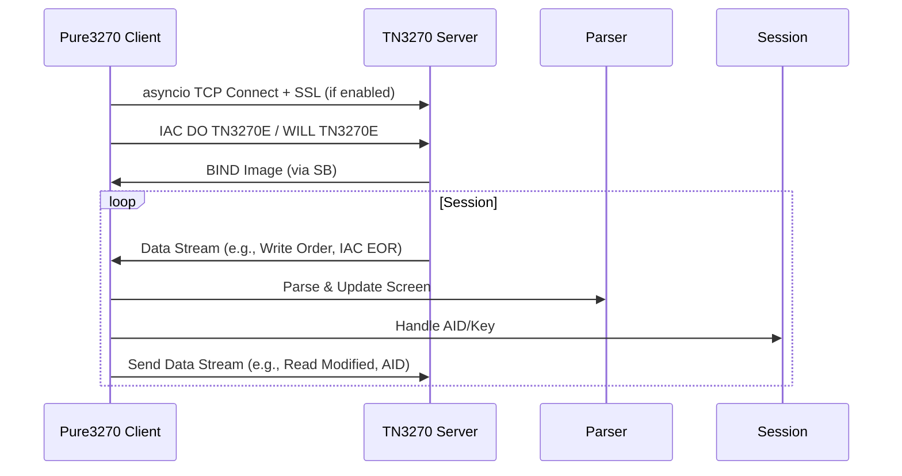

# Pure3270 Architecture Design

## Overview

The `pure3270` library is a self-contained, pure Python 3.8+ implementation designed to emulate the functionality of the `s3270` terminal emulator. It is primarily intended for integration with the `p3270` library through runtime monkey-patching, allowing seamless replacement of `p3270`'s underlying dependencies on `s3270` without requiring external binaries or complex setup. The design emphasizes zero-configuration opt-in via a simple `pure3270.enable_replacement()` function, which applies global patching by default but supports selective configuration.

Key design principles:
- **Purity**: Standard library only (e.g., `asyncio` for networking, `ssl` for TLS, `logging` for logs). This maintains self-contained nature without external dependencies or native binaries.
- **Compatibility**: Mirrors `s3270` and `p3270` interfaces where possible, with Pythonic enhancements like context managers and optional asyncio support.
- **Performance**: Efficient byte handling using `bytearray` and `struct` for EBCDIC and protocol streams.
- **Extensibility**: Subclassing for custom behaviors (e.g., extending `Session` or `DataStreamParser`).
- **Robustness**: Comprehensive error handling with custom inline exceptions and structured logging.

The library supports TN3270 and TN3270E protocols, full 3270 terminal emulation (including screen buffer, fields, WCC, AID), and basic key simulation for scripting. Asyncio handles networking and protocol transparently, ensuring API compatibility.

## Package Structure

The package follows a modular directory layout to separate concerns: emulation logic, protocol handling, patching mechanisms. This structure promotes maintainability and allows for easy extension.

Actual directory layout:
```
pure3270/
├── __init__.py          # Public API entrypoint (e.g., enable_replacement(), Session)
├── session.py           # Main Session and AsyncSession classes
├── emulation/           # Core 3270 terminal emulation
│   ├── __init__.py
│   ├── ebcdic.py        # EBCDIC encoding/decoding utilities
│   └── screen_buffer.py # ScreenBuffer class, field management, rendering
├── protocol/            # TN3270/TN3270E protocol implementation
│   ├── __init__.py
│   ├── data_stream.py   # DataStreamParser/Sender for 3270 orders and BIND
│   ├── ssl_wrapper.py   # SSL/TLS integration using stdlib ssl module
│   └── tn3270_handler.py # TN3270Handler for connection, negotiation, data stream handling
└── patching/            # Monkey-patching mechanisms for p3270 integration
    ├── __init__.py
    └── patching.py      # MonkeyPatchManager for dynamic overrides and enable_replacement()

Top-level directories:
- examples/              # Python example scripts (e.g., example_end_to_end.py, example_patching.py)
- tests/                 # Unit and integration tests
- pyproject.toml         # Project configuration and dependencies (standard library only for runtime)
- setup.py               # Setuptools configuration
```

Note: No external runtime dependencies; uses Python standard library. Development dependencies (e.g., pytest) are in pyproject.toml under [project.optional-dependencies.test].

Key modules and classes:

- **`pure3270/__init__.py`**: Exports main classes like `Session` and functions like `enable_replacement()`. Initializes logging.

- **`pure3270/session.py`**:
  - `Session` and `AsyncSession`: Main session handlers integrating emulation and protocol. Supports connect, send (keys/commands), read (screen scraping), macro execution. Uses context managers and asyncio for non-blocking I/O.
  - Exceptions: `Pure3270Error` (base), `SessionError`.

- **`emulation/screen_buffer.py`**:
  - `ScreenBuffer`: Manages the 24x80 (or configurable) screen buffer as a `bytearray` of EBCDIC bytes. Handles attributes (protected/modified), fields (start/end, type), and rendering to text (screen scraping).
  - `Field`: Represents input/output fields with properties for content, attributes (e.g., numeric-only, protected).

- **`emulation/ebcdic.py`**:
  - `EBCDICCodec`: Custom codec for EBCDIC <-> Unicode conversion using translation tables and `cp037` decoding.

- **`protocol/tn3270_handler.py`**:
  - `TN3270Handler`: Handles asyncio-based TCP connections, negotiations (TN3270/TN3270E including EOR, BIND), and subnegotiation. Implements raw telnet commands (IAC/SB) for 3270-specific data stream sending/receiving.
  - Exceptions: `ProtocolError` (base), `NegotiationError`.

- **`protocol/data_stream.py`**:
  - `DataStreamParser`: Parses incoming 3270 data streams (orders like SBA, SF, RA, GE, W), updates screen buffer.
  - `DataStreamSender`: Constructs outgoing streams for commands (e.g., Read Modified Fields, key press with AID).
  - Exception: `ParseError`.

- **`protocol/ssl_wrapper.py`**:
  - `SSLWrapper`: Creates `ssl.SSLContext` for TLS 1.2+ secure connections, with optional certificate verification.
  - Exception: `SSLError`.

- **`patching/patching.py`**:
  - `MonkeyPatchManager`: Core class for applying patches. Uses `sys.modules` manipulation and `types.MethodType` for method overrides on `p3270` (e.g., Session init/connect/send/read).
  - `enable_replacement()`: Zero-config function to apply patches (alias: `patch`).
  - Exception: `Pure3270PatchError`.

## Core Emulation

The emulation layer provides a virtual 3270 terminal without relying on native libraries.

- **Screen Buffer Management**: `ScreenBuffer` (in screen_buffer.py) uses a fixed-size `bytearray` (e.g., 24*80 + attributes). Each position stores EBCDIC char + 3-byte attribute (protection, intensity, etc.). Fields are tracked via a list of `Field` objects with start/end indices. Supports Read Modified All (RMA), Read Modified Fields (RMF) via buffer scanning.

- **EBCDIC Handling**: `EBCDICCodec` (in ebcdic.py) implements bidirectional translation using static dictionaries and `cp037` codec for performance.

- **Fields and Attributes**: WCC parsed to set buffer state (e.g., reset modified flags). AID handling maps keys to actions (e.g., Enter AID=0x7D triggers data send) in session.py.

- **Screen Scraping**: `screen_buffer.py` provides `to_text()` method for ASCII conversion, `get_field_content(field_id)` for extraction.

- **Keyboard Simulation**: Basic key handling in `session.py` via AID mapping (e.g., "key Enter" -> AID 0x7D, "String(hello)" -> text input). No advanced queuing or PS/2 scancodes.

Text-based diagram of screen buffer structure:
```
+------------------- 24 rows -------------------+
| Row 0: [attr][EBCDIC char] * 80              |
| ...                                          |
| Row 23: [attr][EBCDIC char] * 80             |
+----------------------------------------------+
Attributes: byte 0: protected (bit 1), modified (bit 7)
            byte 1: foreground color
            byte 2: background color, highlighting
Fields: List of {start: (row,col), end: (row,col), type: 'input/output'}
```

## Development Setup

All development and usage must occur within a Python virtual environment to manage dependencies cleanly. This ensures isolation and reproducibility.

### Virtual Environment Instructions

1. **Create the virtual environment**:
   ```
   python -m venv .venv
   ```

2. **Activate the virtual environment**:
   - On Unix/macOS:
     ```
     source .venv/bin/activate
     ```
   - On Windows:
     ```
     .venv\Scripts\activate
     ```

3. **Install the library**:
   ```
   pip install -e .
   ```
   No external runtime dependencies; uses standard library. For development/testing, install optional deps: `pip install .[test]`.

4. **Packaging note**: Distributed via `setup.py` or `pyproject.toml` with no `install_requires` for external packages, keeping it self-contained and pure Python.

Deactivate with `deactivate` when done.

## Protocol

Supports TN3270 (RFC 1576) and enhanced TN3270E (RFC 2355) for better reliability.

- **Connection**: `TN3270Handler` (in tn3270_handler.py) uses `asyncio.open_connection` for TCP connections, sends raw DO TN3270E via IAC, handles WILL/WONT for TN3270/TN3270E. For SSL, applies `SSLWrapper` context to the asyncio transport if `secure=True`.

- **Data Stream**: Incoming: Receives via asyncio reader, then `DataStreamParser` (in data_stream.py) decodes 3270 orders (e.g., W (Write), EWA (Erase Write Alternate), SBA, SF). Outgoing: `DataStreamSender` builds 3270 packets, sends via asyncio writer. BIND image parsed for terminal type negotiation and screen sizing.

- **BIND Handling**: Parses BIND command to extract USABLE AREA size, configures `ScreenBuffer` accordingly (e.g., 24x80 or 32x80).

- **Error Handling**: Timeouts via `asyncio.wait_for()`, protocol errors raise `ProtocolError` or `NegotiationError`.

Text-based diagram for asyncio integration flow:
```
Pure3270 Client --> asyncio.open_connection --> TCP/SSL Transport
                    Negotiation (IAC DO TN3270E, SB DEVICE_TYPE)
                    Data Send/Recv (raw IAC/SB telnet layer)
                    Custom 3270 Parser/Sender (on top of asyncio streams)
SSLWrapper (if secure) --> Provides ssl.SSLContext for asyncio
```

Mermaid diagram for protocol flow:


## Patching Mechanism

Runtime monkey-patching integrates with `p3270` by overriding its internal calls to `s3270`.

- **Strategies**:
  - **Method Overrides**: Use `setattr` and `MethodType` on `p3270.session.Session` to swap `__init__`, `connect`, `send`, `read`, `close` with pure3270 equivalents (delegating to `Session`).
  - **Version Check**: Inspect `p3270.__version__` for compatibility; warn/log on mismatch, optional strict raise.
  - **Fallback**: If `p3270` not installed or mismatch, log warning and simulate/mock for verification.

- **Configuration API**:
  - `enable_replacement(global=True, selective_modules=['session'], strict_version=False)`: Applies patches. Selective targets session/commands.
  - `patch()`: Alias for `enable_replacement()` for zero-config.

- **Implementation**: Single `patching.py` with `MonkeyPatchManager` as context manager for reversible patches:
  ```python
  from pure3270.patching.patching import enable_replacement
  enable_replacement()  # Applies patches
  ```

Text-based diagram for patching flow:
```
p3270 Session.__init__() --> override --> Pure3270 Session._pure_session
p3270.Session.connect() --> delegate --> Pure3270Session.connect(asyncio)
If mismatch: Log & Proceed (or raise if strict) --> Partial/Original
```

## API Compatibility

The API remains fully compatible with existing p3270 and s3270 interfaces. Asyncio integration is handled transparently under the hood in `TN3270Handler` and `AsyncSession`, with no changes to public methods like `connect()`, `send()`, or `read_screen()`. Developers using the library or patched p3270 sessions will not notice the switch to pure Python emulation.

- **Mirroring s3270**: `Session` class with `connect(host, port=23)`, `send('key Enter')`, `read()` (returns text), `disconnect()` via `close()`. Supports scripting commands like `s3270` (e.g., `String("field")`).

- **Pythonic Features**:
  - Context manager: `with Session() as sess: sess.connect(...)`
  - Asyncio: `AsyncSession` for non-blocking I/O.
  - Properties: Access via `read()` for scraping.

- **Standalone Usage**: Can be used independently without patching, e.g., `sess = Session(); sess.connect('host')`.

## Extensibility

- **Subclassing**: Extend `Session` for custom session logic, `DataStreamParser` for new orders, or `MonkeyPatchManager` for additional overrides.
- **Custom Patches**: Modify `apply_patches()` in `MonkeyPatchManager` for selective integrations beyond p3270.

## Error Handling, Logging, Performance

- **Errors**: Inline exceptions: `Pure3270Error` (base, in session.py/patching.py), `SessionError` (session.py), `ProtocolError`/`NegotiationError` (tn3270_handler.py), `ParseError` (data_stream.py), `SSLError` (ssl_wrapper.py), `Pure3270PatchError` (patching.py). Raised with context (e.g., connection details).

- **Logging**: Uses stdlib `logging` module. Default: INFO level, with `pure3270` logger. Protocol traces at DEBUG. Configurable via `setup_logging(level='DEBUG')` in __init__.py.

- **Performance**: Byte operations with `bytearray` for mutable buffers. Avoid string conversions; use `asyncio` for efficient I/O. Target: <1ms per screen update.

## Integration Examples

- **Patching** (see top-level examples/example_patching.py):
  1. Import: `from pure3270 import enable_replacement; enable_replacement()`
  2. Use p3270 normally: `from p3270 import Session; sess = Session(); sess.connect('host')` – internally uses pure3270.

- **Standalone** (see top-level examples/example_end_to_end.py):
  1. `from pure3270 import Session; with Session(secure=True) as sess: sess.connect('host', 992); sess.send('key PF3'); print(sess.read())`

- **Selective Patching**: `enable_replacement(patch_sessions=True, patch_commands=False)` – Only overrides session methods.

This design ensures seamless integration, high fidelity to 3270 standards, and room for growth.