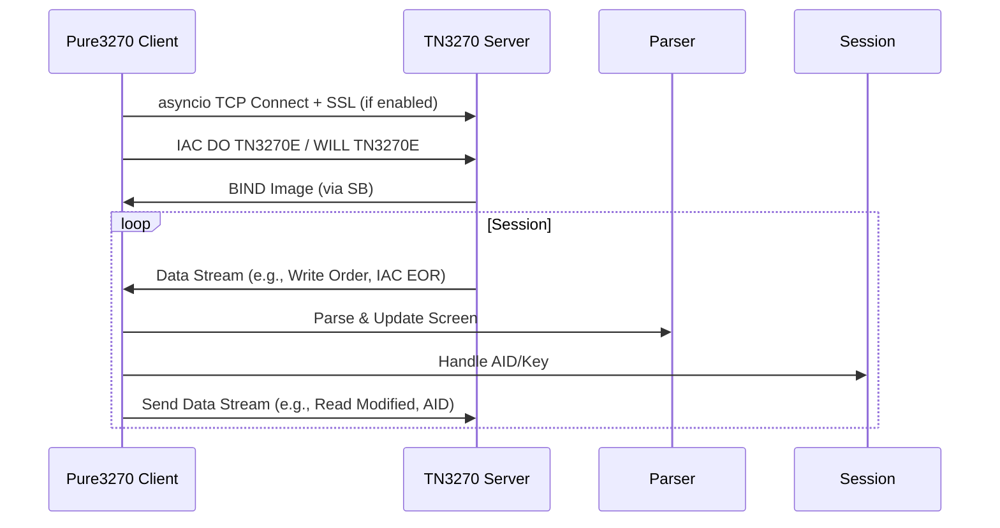

# Pure3270 Architecture Design

## Overview

The `pure3270` library is a self-contained, pure Python 3.10+ implementation designed to emulate the functionality of the `s3270` terminal emulator. It provides a native `P3270Client` class that serves as a direct drop-in replacement for `p3270.P3270Client`, eliminating the need for external `s3270` binaries or complex setup.

Key design principles:
- **Purity**: Standard library only (e.g., `asyncio` for networking, `ssl` for TLS, `logging` for logs). This maintains self-contained nature without external dependencies or native binaries.
- **Compatibility**: Mirrors `s3270` and `p3270` interfaces where possible, with Pythonic enhancements like context managers and optional asyncio support.
- **Performance**: Efficient byte handling using `bytearray` and `struct` for EBCDIC and protocol streams.
- **Extensibility**: Subclassing for custom behaviors (e.g., extending `Session` or `DataStreamParser`).
- **Robustness**: Comprehensive error handling with custom inline exceptions and structured logging.

## Scope and Limitations

Macro mode is out of scope for this project and will not be implemented. It has been removed and will not be reintroduced.

The library supports TN3270 and TN3270E protocols, full 3270 terminal emulation (including screen buffer, fields, WCC, AID), and basic key simulation for scripting. Asyncio handles networking and protocol transparently, ensuring API compatibility.

## Package Structure

The package follows a modular directory layout to separate concerns: emulation logic, protocol handling, and client compatibility. This structure promotes maintainability and allows for easy extension.

Actual directory layout:
```
pure3270/
├── __init__.py          # Public API entrypoint (e.g., enable_replacement(), Session)
├── session.py           # Main Session and AsyncSession classes
├── emulation/           # Core 3270 terminal emulation
│   ├── __init__.py
│   ├── ebcdic.py        # EBCDIC encoding/decoding utilities
│   └── screen_buffer.py # ScreenBuffer class, field management, rendering
├── protocol/            # TN3270/TN3270E protocol implementation
│   ├── __init__.py
│   ├── data_stream.py   # DataStreamParser/Sender for 3270 orders and BIND
│   ├── ssl_wrapper.py   # SSL/TLS integration using stdlib ssl module
│   ├── tn3270_handler.py # TN3270Handler for connection, negotiation, data stream handling
│   ├── negotiator.py    # TN3270/TN3270E negotiation logic
│   ├── printer.py       # Printer session support
│   ├── tn3270e_header.py # TN3270E header processing
│   └── utils.py         # Telnet command utilities
└── patching/            # Legacy patching mechanisms (deprecated)
    ├── __init__.py
    └── patching.py      # Legacy MonkeyPatchManager for backward compatibility

Top-level directories:
- examples/              # Python example scripts (e.g., example_end_to_end.py, example_standalone.py)
- tests/                 # Unit and integration tests
- pyproject.toml         # Project configuration and dependencies (standard library only for runtime)
- setup.py               # Setuptools configuration
```

Note: No external runtime dependencies; uses Python standard library. Development dependencies (e.g., pytest) are in pyproject.toml under [project.optional-dependencies.test].

Key modules and classes:

- **`pure3270/__init__.py`**: Exports main classes like `Session` and functions like `enable_replacement()`. Initializes logging.

- **`pure3270/session.py`**:
  - `Session` and `AsyncSession`: Main session handlers integrating emulation and protocol. Supports connect, send (keys/commands), and read (screen scraping). Uses context managers and asyncio for non-blocking I/O. Macro scripting/DSL is not supported.
  - Exceptions: `Pure3270Error` (base), `SessionError`.

- **`emulation/screen_buffer.py`**:
  - `ScreenBuffer`: Manages the 24x80 (or configurable) screen buffer as a `bytearray` of EBCDIC bytes. Handles attributes (protected/modified), fields (start/end, type), and rendering to text (screen scraping).
  - `Field`: Represents input/output fields with properties for content, attributes (e.g., numeric-only, protected).

- **`emulation/ebcdic.py`**:
  - `EBCDICCodec`: Custom codec for EBCDIC <-> Unicode conversion using translation tables and `cp037` decoding.

- **`protocol/tn3270_handler.py`**:
  - `TN3270Handler`: Handles asyncio-based TCP connections, negotiations (TN3270/TN3270E including EOR, BIND), and subnegotiation. Implements raw telnet commands (IAC/SB) for 3270-specific data stream sending/receiving.
  - Exceptions: `ProtocolError` (base), `NegotiationError`.

- **`protocol/negotiator.py`**:
  - `Negotiator`: Handles TN3270/TN3270E negotiation logic, including device type and function negotiation.

- **`protocol/printer.py`**:
  - `PrinterSession`: Handles printer session support for TN3270E protocol.
  - `PrinterJob`: Represents a printer job in a TN3270E printer session.

- **`protocol/tn3270e_header.py`**:
  - `TN3270EHeader`: Processes TN3270E message headers.

- **`protocol/data_stream.py`**:
  - `DataStreamParser`: Parses incoming 3270 data streams (orders like SBA, SF, RA, GE, W), updates screen buffer.
  - `DataStreamSender`: Constructs outgoing streams for commands (e.g., Read Modified Fields, key press with AID).
  - Exception: `ParseError`.

- **`protocol/ssl_wrapper.py`**:
  - `SSLWrapper`: Creates `ssl.SSLContext` for TLS 1.2+ secure connections, with optional certificate verification.
  - Exception: `SSLError`.

- **`protocol/utils.py`**:
  - Utility functions for telnet commands and IAC sequence processing.

- **`patching/patching.py`**:
  - `MonkeyPatchManager`: Legacy class for backward compatibility. No longer recommended.
  - `enable_replacement()`: Legacy function for patching (deprecated).
  - Exception: `Pure3270PatchError`.

## Core Emulation

The emulation layer provides a virtual 3270 terminal without relying on native libraries.

- **Screen Buffer Management**: `ScreenBuffer` (in screen_buffer.py) uses a fixed-size `bytearray` (e.g., 24*80 + attributes). Each position stores EBCDIC char + 3-byte attribute (protection, intensity, etc.). Fields are tracked via a list of `Field` objects with start/end indices. Supports Read Modified All (RMA), Read Modified Fields (RMF) via buffer scanning.

- **EBCDIC Handling**: `EBCDICCodec` (in ebcdic.py) implements bidirectional translation using static dictionaries and `cp037` codec for performance.

- **Fields and Attributes**: WCC parsed to set buffer state (e.g., reset modified flags). Extended field attribute handling now supports intensity, color, validation, and outlining attributes beyond basic protection/numeric. Proper field modification tracking ensures RMF/RMA commands work correctly by updating field modified flags when users type into fields.

- **Screen Scraping**: `screen_buffer.py` provides `to_text()` method for ASCII conversion, `get_field_content(field_id)` for extraction.

- **Keyboard Simulation**: Enhanced AID handling maps all keys to actions (e.g., Enter AID=0x7D, PF1-PF24, PA1-PA3) in session.py. Support for missing s3270 actions: Compose(), Cookie(), Expect(), Fail().

Text-based diagram of screen buffer structure:
```
+------------------- 24 rows -------------------+
| Row 0: [attr][EBCDIC char] * 80              |
| ...                                          |
| Row 23: [attr][EBCDIC char] * 80             |
+----------------------------------------------+
Attributes: byte 0: protected (bit 1), modified (bit 7)
            byte 1: foreground color
            byte 2: background color, highlighting
Fields: List of {start: (row,col), end: (row,col), type: 'input/output'}
```

## Protocol

Supports TN3270 (RFC 1576) and enhanced TN3270E (RFC 2355) for better reliability.

- **Connection**: `TN3270Handler` (in tn3270_handler.py) uses `asyncio.open_connection` for TCP connections, sends raw DO TN3270E via IAC, handles WILL/WONT for TN3270/TN3270E. For SSL, applies `SSLWrapper` context to the asyncio transport if `secure=True`.

- **Negotiation**: `Negotiator` (in negotiator.py) handles TN3270/TN3270E negotiation, including device type and function negotiation.

- **Data Stream**: Incoming: Receives via asyncio reader, then `DataStreamParser` (in data_stream.py) decodes 3270 orders (e.g., W (Write), EWA (Erase Write Alternate), SBA, SF). Outgoing: `DataStreamSender` builds 3270 packets, sends via asyncio writer. BIND image parsed for terminal type negotiation and screen sizing.

- **BIND Handling**: Parses BIND command to extract USABLE AREA size, configures `ScreenBuffer` accordingly (e.g., 24x80 or 32x80).

- **Printer Support**: `PrinterSession` (in printer.py) handles printer session support for TN3270E protocol, including SCS character data processing and PRINT-EOJ handling.

- **TN3270E Header Processing**: `TN3270EHeader` (in tn3270e_header.py) processes TN3270E message headers with DATA-TYPE, REQUEST-FLAG, RESPONSE-FLAG, SEQ-NUMBER.

- **Error Handling**: Timeouts via `asyncio.wait_for()`, protocol errors raise `ProtocolError` or `NegotiationError`.

## Development Setup

All development and usage must occur within a Python virtual environment to manage dependencies cleanly. This ensures isolation and reproducibility.

### Virtual Environment Instructions

1. **Create the virtual environment**:
   ```
   python -m venv .venv
   ```

2. **Activate the virtual environment**:
   - On Unix/macOS:
     ```
     source .venv/bin/activate
     ```
   - On Windows:
     ```
     .venv\Scripts\activate
     ```

3. **Install the library**:
   ```
   pip install -e .
   ```
   No external runtime dependencies; uses standard library. For development/testing, install optional deps: `pip install .[test]`.

4. **Packaging note**: Distributed via `setup.py` or `pyproject.toml` with no `install_requires` for external packages, keeping it self-contained and pure Python.

Deactivate with `deactivate` when done.

## Testing

Pure3270 includes a comprehensive test suite that runs entirely in Python without external dependencies:

### Modern CI System
- **CI Shell Script** (`ci.sh`): Main entry point for all CI operations with make-like interface
- **Comprehensive CI Runner** (`run_full_ci.py`): Python CI runner matching GitHub Actions exactly
- **Local CI Wrapper** (`local_ci.py`): Python wrapper with common CI presets
- **Quick Smoke Test** (`quick_test.py`): Fast test (<10 seconds) for basic functionality
- **Navigation Method Test** (`navigation_method_test.py`): Specific test for navigation method availability

### Running Tests
All tests can be run using the modern CI system:

```bash
# Quick CI tests (recommended)
./ci.sh

# Full CI suite (matches GitHub Actions)
./ci.sh full

# Format code
./ci.sh format

# Unit tests only
python -m pytest tests/
```

### GitHub Actions
The project uses GitHub Actions for continuous integration:
- **Quick CI** (`quick-ci.yml`): Runs on PRs to non-main branches
- **Full CI** (`ci.yml`): Runs on PRs to main/develop and pushes to those branches
- **Release Validation** (`release.yml`): Runs on release publication

All workflows run tests across multiple Python versions without requiring Docker.

## Protocol

Supports TN3270 (RFC 1576) and enhanced TN3270E (RFC 2355) for better reliability.

- **Connection**: `TN3270Handler` (in tn3270_handler.py) uses `asyncio.open_connection` for TCP connections, sends raw DO TN3270E via IAC, handles WILL/WONT for TN3270/TN3270E. For SSL, applies `SSLWrapper` context to the asyncio transport if `secure=True`.

- **Data Stream**: Incoming: Receives via asyncio reader, then `DataStreamParser` (in data_stream.py) decodes 3270 orders (e.g., W (Write), EWA (Erase Write Alternate), SBA, SF). Outgoing: `DataStreamSender` builds 3270 packets, sends via asyncio writer. BIND image parsed for terminal type negotiation and screen sizing.

- **BIND Handling**: Parses BIND command to extract USABLE AREA size, configures `ScreenBuffer` accordingly (e.g., 24x80 or 32x80).

- **Error Handling**: Timeouts via `asyncio.wait_for()`, protocol errors raise `ProtocolError` or `NegotiationError`.

Text-based diagram for asyncio integration flow:
```
Pure3270 Client --> asyncio.open_connection --> TCP/SSL Transport
                    Negotiation (IAC DO TN3270E, SB DEVICE_TYPE)
                    Data Send/Recv (raw IAC/SB telnet layer)
                    Custom 3270 Parser/Sender (on top of asyncio streams)
SSLWrapper (if secure) --> Provides ssl.SSLContext for asyncio
```

Mermaid diagram for protocol flow:


## Legacy Patching Mechanism (Deprecated)

The library previously supported runtime monkey-patching to integrate with `p3270`, but this approach has been deprecated in favor of the native `P3270Client` implementation.

- **Legacy Support**: The `patching` module remains for backward compatibility but is no longer recommended.
- **Migration**: Use the native `P3270Client` class instead of patching.

For historical reference, the patching mechanism used `sys.modules` manipulation and method overrides to replace `p3270` functionality.

## API Compatibility

The API provides full compatibility with existing p3270 and s3270 interfaces through the native `P3270Client` class. Asyncio integration is handled transparently under the hood in `TN3270Handler` and `AsyncSession`, with no changes to public methods like `connect()`, `send()`, or `read_screen()`.

- **Mirroring s3270**: `Session` class with `connect(host, port=23)`, `send(b'key Enter')`, `read()` (returns bytes), `disconnect()` via `close()`. Supports scripting commands like `s3270` (e.g., `String("field")`).

- **Pythonic Features**:
  - Context manager: `with Session() as sess: sess.connect(...)`
  - Asyncio: `AsyncSession` for non-blocking I/O.
  - Properties: Access via `read()` for scraping.

- **Standalone Usage**: Can be used independently without patching, e.g., `sess = Session(); sess.connect('host')`.

Macro scripting/DSL has been removed and will not be reintroduced.

- **Resource Definition Support**: Supports loading resource definitions from xrdb format files.

## Extensibility

- **Subclassing**: Extend `Session` for custom session logic, `DataStreamParser` for new orders, or `MonkeyPatchManager` for additional overrides.
- **Custom Extensions**: Extend `P3270Client` or `Session` classes for custom integrations.

## Error Handling, Logging, Performance

- **Errors**: Inline exceptions: `Pure3270Error` (base, in session.py), `SessionError` (session.py), `ProtocolError`/`NegotiationError` (tn3270_handler.py), `ParseError` (data_stream.py), `SSLError` (ssl_wrapper.py), `Pure3270PatchError` (patching.py, legacy). Raised with context (e.g., connection details).

- **Logging**: Uses stdlib `logging` module. Default: INFO level, with `pure3270` logger. Protocol traces at DEBUG. Configurable via `setup_logging(level='DEBUG')` in __init__.py.

- **Performance**: Byte operations with `bytearray` for mutable buffers. Avoid string conversions; use `asyncio` for efficient I/O. Target: <1ms per screen update.

## Integration Examples

- **Native P3270Client** (see top-level examples/example_end_to_end.py):
  1. `from pure3270 import P3270Client; client = P3270Client(); client.connect('host'); client.sendEnter(); print(client.getScreen())`

- **Standalone** (see top-level examples/example_standalone.py):
  1. `from pure3270 import Session; with Session(secure=True) as sess: sess.connect('host', 992); sess.send('key PF3'); print(sess.read())`

This design ensures seamless integration, high fidelity to 3270 standards, and room for growth.
